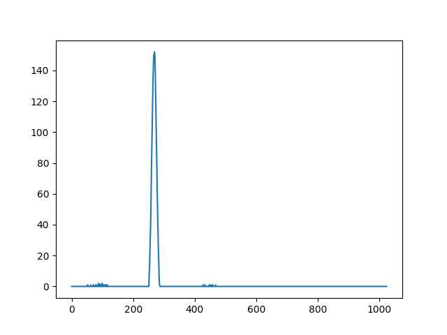

Peak Detection with DNN
=======================

This project is the product of an assignment received for a technical interview. 
The **minimum goal** of the exercise was to detect one peak in one-dimensional signals vector 
using a Deep Neural Network.
Optional goals are:
- Identify all peaks in the signals.
- Build a network that can work on variable input length.
- Write a C/C++ program to run inference on random data.

The dataset has been provided in binary format files. 
The info.raw file contains the information on how to interpret the signal.raw file. 
info.raw contains 50'000 entries of 11 float values in the following format:

signal length, number of peaks, (peak position 1, peak height 1, peak width 1), 
[...],
(pos. 3, h. 3, w. 3).

For example the first vector in the file info.raw has the following data:

(610.0, 1.0, 268.2593688964844, 165.65737915039062, 7.799757957458496, 0.0, 0.0, 0.0, 0.0, 0.0, 0.0, 847.0)

The signal.raw file contains the values of the signal to interpret. 
Each signal is stored in 1024 unsigned integers values. 
An example of the first signal can be seen in the picture below.

The project has been developed using PyCharm IDE with Python 3.9. To test it you can run the file train.py in src\models.
It is necessary to install the dependencies specified in the file requirements.txt to have all the required packages.
